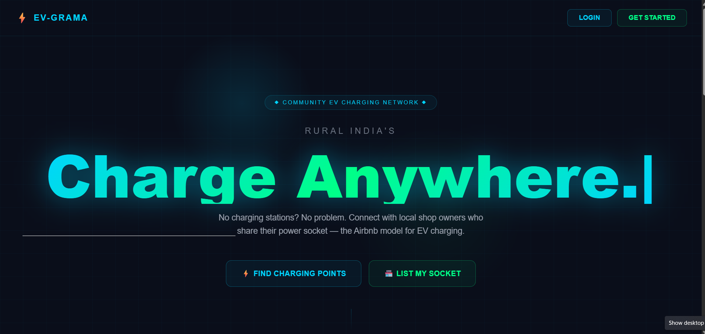
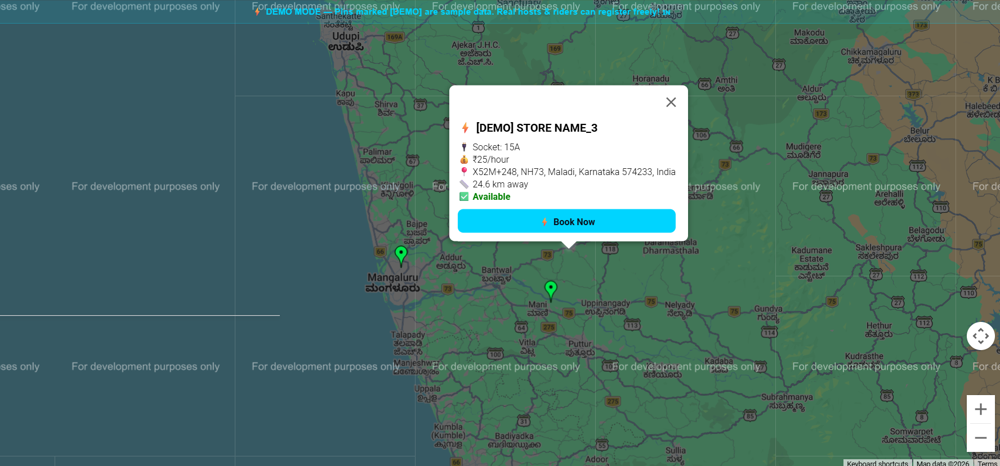
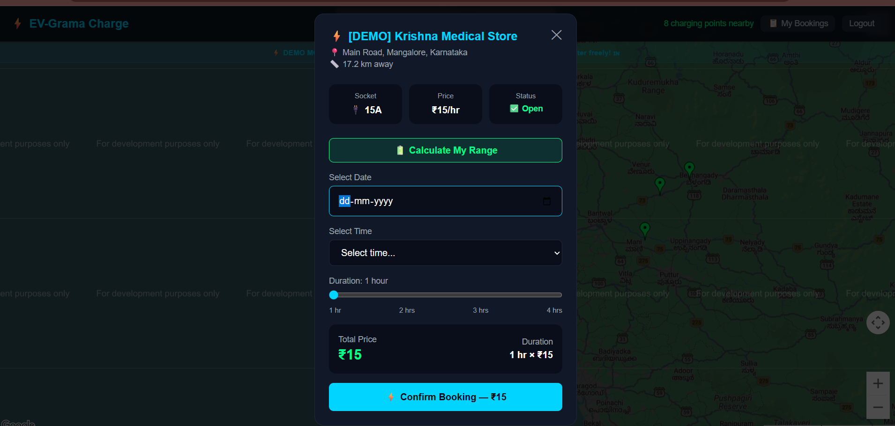
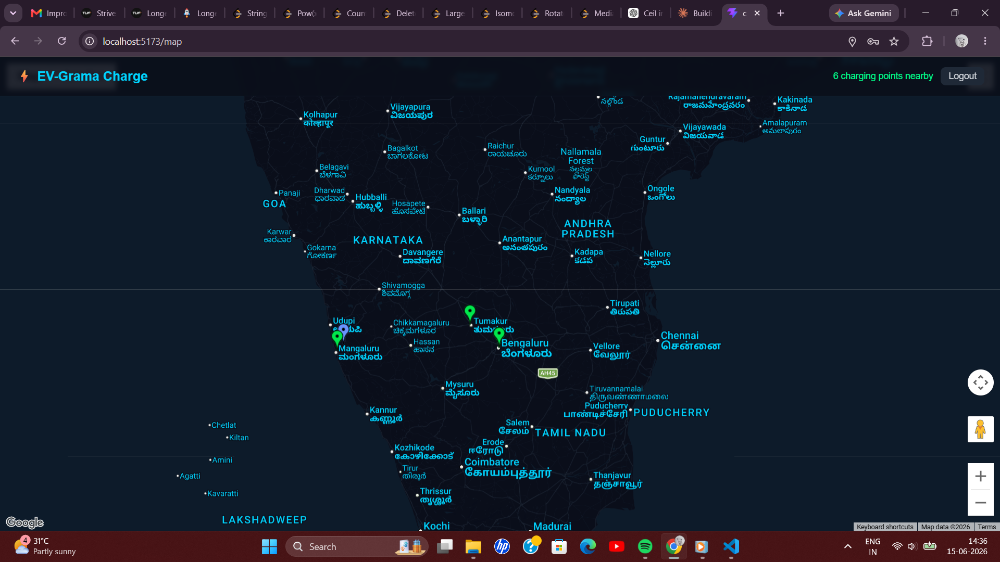
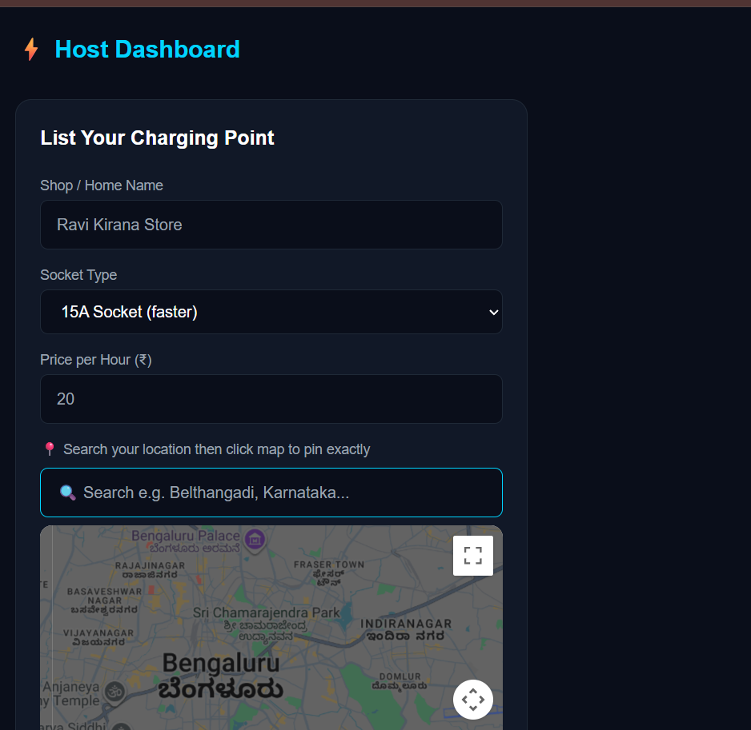
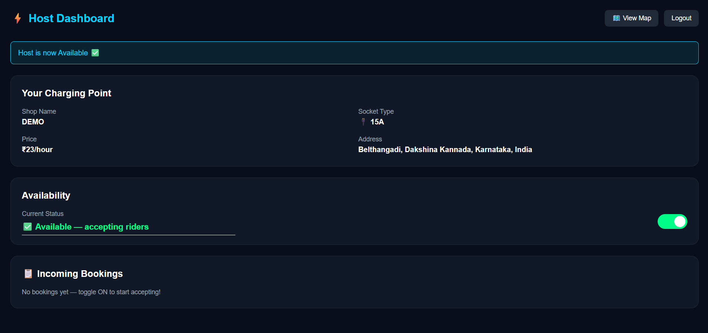

# EV-Grama Charge

A community EV charging network for rural India. Local shop owners can list their 15A power sockets as public charging points, and EV riders can find, book, and pay for charging slots nearby — an Airbnb-style model for EV charging without dedicated infrastructure.

---

## Live Demo

- Frontend: https://your-vercel-url.vercel.app
- Backend: https://your-render-url.onrender.com
- GitHub: https://github.com/Rakshitha-Kotyan/EV-Grama-Charge

---

## Screenshots

### Landing Page


### Map View


### Booking Modal


### Host Dashboard


### My Bookings


### Range Calculator


---

## Tech Stack

**Frontend**
- React.js with Vite
- Tailwind CSS
- React Router DOM
- Axios
- Google Maps JavaScript API
- Google Places API
- Google Geocoding API

**Backend**
- Node.js
- Express.js
- MongoDB Atlas with Mongoose
- JSON Web Tokens (JWT)
- bcryptjs

**Deployment**
- Frontend: Vercel
- Backend: Render
- Database: MongoDB Atlas

---

## Features

- Interactive map showing real-time charging points with distance from current location
- Host registration with click-to-pin location on map and automatic address fill via Geocoding API
- Google Places search box for hosts to find their location easily
- Availability toggle for hosts to turn their charging point ON or OFF in real time
- Booking system with date, time, and duration selection and automatic price calculation
- Host dashboard showing incoming bookings with rider details
- Rider bookings page with ability to mark as completed or cancel
- Physics-based range calculator showing estimated km from a given charge duration
- Role-based authentication — separate flows for Riders and Hosts
- JWT authentication with bcrypt password hashing

---

## Project Structure

```
EV-Grama-Charge/
├── client/                         
│   ├── src/
│   │   ├── components/
│   │   │   ├── BookingModal.jsx    
│   │   │   └── RangeCalculator.jsx 
│   │   ├── pages/
│   │   │   ├── Landing.jsx         
│   │   │   ├── Login.jsx           
│   │   │   ├── Register.jsx        
│   │   │   ├── Map.jsx             
│   │   │   ├── HostDashboard.jsx   
│   │   │   └── MyBookings.jsx      
│   │   └── utils/
│   │       └── api.js              
│   ├── tailwind.config.js          
│   └── .env                        
│
└── server/                         
    ├── models/
    │   ├── User.js                 
    │   ├── Host.js                 
    │   └── Booking.js              
    ├── routes/
    │   ├── auth.js                 
    │   ├── hosts.js                
    │   └── bookings.js             
    └── index.js                    
```

---

## Getting Started Locally

### Prerequisites
- Node.js v18 or above
- MongoDB Atlas account
- Google Cloud account with Maps, Places, and Geocoding APIs enabled

### Clone the repository
```bash
git clone https://github.com/Rakshitha-Kotyan/EV-Grama-Charge.git
cd EV-Grama-Charge
```

### Backend setup
```bash
cd server
npm install
```

Create a `.env` file inside the server folder:
```
MONGO_URI=your_mongodb_atlas_connection_string
JWT_SECRET=your_jwt_secret_key
PORT=5000
```

Start the backend:
```bash
npm run dev
```

### Frontend setup
```bash
cd client
npm install
```

Create a `.env` file inside the client folder:
```
VITE_GOOGLE_MAPS_API_KEY=your_google_maps_api_key
VITE_API_URL=http://localhost:5000/api
```

Start the frontend:
```bash
npm run dev
```

Open http://localhost:5173 in your browser.

---

## User Roles

**Rider**
- Register with the Rider role
- View the live map of available charging points
- Book a charging slot with date, time, and duration
- Use the range calculator before booking
- View and manage bookings

**Host**
- Register with the Host role
- List a charging point by dropping a pin on the map
- Set socket type, price per hour, and address
- Toggle availability on or off in real time
- View incoming bookings with rider details

---

## API Endpoints

**Auth**
- POST /api/auth/register
- POST /api/auth/login

**Hosts**
- GET /api/hosts
- POST /api/hosts
- GET /api/hosts/:id
- PATCH /api/hosts/:id/toggle
- PATCH /api/hosts/:id
- DELETE /api/hosts/:id

**Bookings**
- POST /api/bookings
- GET /api/bookings/rider/:riderId
- GET /api/bookings/host/:hostId
- PATCH /api/bookings/:id/status

---

## Note

This project is currently live with demo data for showcase purposes. The platform is fully functional and open for real hosts and riders to register and use.

---

## Developer

Rakshitha Kotyan
- LinkedIn: https://linkedin.com/in/rakshitha-kotyan
- GitHub: https://github.com/Rakshitha-Kotyan

---

## License

This project is open source and available under the MIT License.
